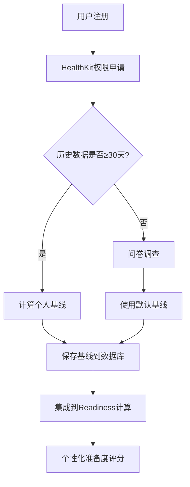
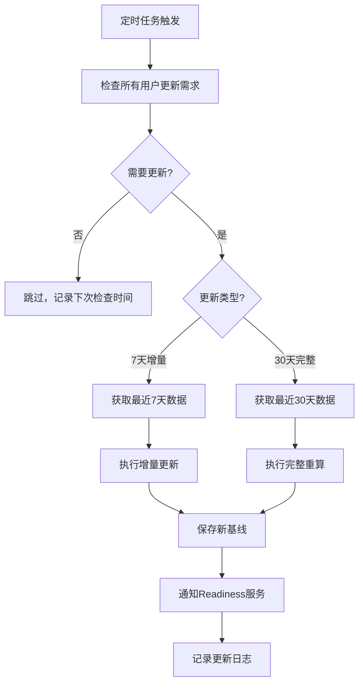

# Baseline模块完整部署与集成指南

一个完整的个人基线管理系统，为readiness准备度评估提供个性化支持。

## 📋 目录

1. [系统架构](#系统架构)
2. [文件结构和作用](#文件结构和作用)
3. [部署步骤](#部署步骤)
4. [API接口详解](#api接口详解)
5. [数据流程](#数据流程)
6. [自动化更新机制](#自动化更新机制)
7. [与Readiness集成](#与readiness集成)
8. [监控和维护](#监控和维护)

---

## 系统架构

```
📱 用户App                    🖥️ 后端服务                    🧠 Readiness引擎
    ↓                           ↓                             ↓
HealthKit数据获取 → 基线计算服务 → 基线数据库存储 → 准备度计算API
                     ↓                ↓              ↓
                [初始基线计算]  [定时更新任务]  [个性化阈值]
```

### 核心组件

- **基线计算引擎**: 从HealthKit数据计算个人基线
- **更新调度器**: 7天增量更新 + 30天完整更新
- **存储管理器**: 支持SQLite/MySQL/PostgreSQL
- **集成接口**: 与Readiness模块无缝对接

---

## 文件结构和作用

```
baseline/
├── __init__.py                 # 模块导出和版本信息
├── models.py                   # 数据模型定义
├── calculator.py               # 基线计算核心算法
├── service.py                  # 业务逻辑和API接口
├── updater.py                  # 7天/30天更新逻辑
├── storage.py                  # 数据存储抽象层
├── healthkit_integration.py    # HealthKit数据解析
├── default_baselines.py        # 新用户默认基线
├── examples/                   # 使用示例
│   ├── basic_usage.py
│   ├── healthkit_integration.py
│   └── readiness_integration.py
├── README.md                   # 模块说明文档
├── QUESTIONNAIRE.md           # 新用户问卷设计
└── DEPLOYMENT_GUIDE.md        # 本文档
```

### 关键文件详解

#### 1. `service.py` - 核心业务接口
```python
# 主要函数
compute_baseline_from_healthkit_data()  # 从HealthKit计算基线
update_baseline_smart()                # 智能更新（推荐）
update_baseline_incremental()          # 7天增量更新
update_baseline_full()                # 30天完整更新
check_baseline_update_needed()         # 检查更新需求
get_baseline_update_schedule()         # 获取更新计划
```

#### 2. `updater.py` - 更新调度逻辑
```python
# 更新策略类
class UpdateStrategy:
    incremental_days: int = 7        # 增量更新周期
    full_update_days: int = 30       # 完整更新周期
    incremental_weight: float = 0.3  # 新数据权重
    min_data_quality: float = 0.7    # 质量阈值

# 更新器类
class BaselineUpdater:
    check_update_needed()       # 检查更新需求
    perform_incremental_update() # 执行增量更新
    perform_full_update()       # 执行完整更新
    smart_update()              # 智能选择更新类型
```

#### 3. `models.py` - 数据模型
```python
@dataclass
class SleepRecord:
    sleep_duration_minutes: int    # 睡眠时长（分钟）
    time_in_bed_minutes: int      # 在床时间
    deep_sleep_minutes: int       # 深度睡眠
    rem_sleep_minutes: int        # REM睡眠

@dataclass  
class HRVRecord:
    sdnn_value: float            # HRV SDNN值（ms）
    timestamp: datetime          # 测量时间

@dataclass
class BaselineResult:
    sleep_baseline_hours: float       # 个人睡眠基线
    sleep_baseline_eff: float        # 个人睡眠效率基线
    hrv_baseline_mu: float           # 个人HRV均值基线
    hrv_baseline_sd: float           # 个人HRV标准差
    # ... 更多字段
```

#### 4. `storage.py` - 存储管理
```python
# 存储抽象基类
class BaselineStorage:
    save_baseline()    # 保存基线
    get_baseline()     # 获取基线
    delete_baseline()  # 删除基线

# 具体实现
class SQLiteBaselineStorage(BaselineStorage)  # SQLite存储
class MySQLBaselineStorage(BaselineStorage)   # MySQL存储（需实现）
class MemoryBaselineStorage(BaselineStorage)  # 内存存储（测试用）
```

---

## 部署步骤

### 步骤1: 环境准备

```bash
# 1. 安装依赖
pip install -r requirements.txt

# 2. 设置环境变量
export BASELINE_STORAGE_TYPE=sqlite          # 存储类型
export BASELINE_DB_PATH=/data/baseline.db    # 数据库路径
export BASELINE_LOG_LEVEL=INFO               # 日志级别

# 3. 创建数据库表
python -c "from baseline.storage import SQLiteBaselineStorage; SQLiteBaselineStorage().init_db()"
```

### 步骤2: 基线计算服务部署

```python
# app.py - Flask/FastAPI应用示例
from baseline import (
    compute_baseline_from_healthkit_data,
    update_baseline_smart,
    check_baseline_update_needed,
    SQLiteBaselineStorage
)

# 初始化存储
storage = SQLiteBaselineStorage("/data/baseline.db")

@app.post("/api/baseline/calculate")
def calculate_baseline(request: HealthKitDataRequest):
    """首次计算用户基线"""
    
    result = compute_baseline_from_healthkit_data(
        user_id=request.user_id,
        healthkit_sleep_data=request.sleep_data,
        healthkit_hrv_data=request.hrv_data,
        storage=storage,
        sleeper_type=request.sleeper_type,  # 新用户问卷结果
        hrv_type=request.hrv_type
    )
    
    return {
        "status": result["status"],
        "baseline": result.get("baseline"),
        "data_quality": result.get("data_quality"),
        "message": result.get("message")
    }

@app.post("/api/baseline/update")  
def update_baseline(request: UpdateRequest):
    """更新用户基线"""
    
    result = update_baseline_smart(
        user_id=request.user_id,
        sleep_data=request.recent_sleep_data,
        hrv_data=request.recent_hrv_data,
        storage=storage
    )
    
    return result
```

### 步骤3: 定时任务设置

```python
# scheduler.py - 定时更新任务
from celery import Celery
from baseline import check_baseline_update_needed, update_baseline_smart

app = Celery('baseline_updater')

@app.task
def daily_baseline_check():
    """每日基线更新检查任务"""
    
    # 获取所有用户列表
    users = get_all_users()
    
    for user_id in users:
        try:
            # 检查更新需求
            check_result = check_baseline_update_needed(user_id, storage)
            
            if check_result['needs_update']:
                # 获取用户最新数据
                sleep_data, hrv_data = get_user_recent_data(
                    user_id, 
                    days=30 if check_result['update_type'] == 'full' else 7
                )
                
                # 执行更新
                update_result = update_baseline_smart(
                    user_id, sleep_data, hrv_data, storage
                )
                
                # 记录日志
                log_baseline_update(user_id, update_result)
                
        except Exception as e:
            logger.error(f"用户{user_id}基线更新失败: {e}")

# 设置定时任务
from celery.schedules import crontab

app.conf.beat_schedule = {
    'daily-baseline-check': {
        'task': 'scheduler.daily_baseline_check',
        'schedule': crontab(hour=2, minute=0),  # 每天凌晨2点执行
    },
}
```

### 步骤4: 与Readiness集成

```python
# readiness_service.py - 修改原有准备度计算
from baseline import get_user_baseline
from baseline.storage import get_default_storage

def calculate_user_readiness(user_id: str, today_data: dict) -> dict:
    """计算用户准备度（集成个人基线）"""
    
    # 1. 获取用户个人基线
    storage = get_default_storage()
    baseline = get_user_baseline(user_id, storage)
    
    # 2. 构造readiness计算payload
    readiness_payload = {
        'user_id': user_id,
        'date': today_data['date'],
        'gender': today_data['gender'],
        'objective': {},  # 将通过mapping填充
        'hooper': today_data['hooper'],
        'journal': today_data['journal']
    }
    
    # 3. 准备mapping输入数据
    mapping_input = today_data['objective_data'].copy()
    
    # 4. 注入个人基线（关键步骤！）
    if baseline:
        baseline_payload = baseline.to_readiness_payload()
        mapping_input.update(baseline_payload)
        
        logger.info(f"用户{user_id}使用个人基线: "
                   f"睡眠{baseline_payload.get('sleep_baseline_hours')}h, "
                   f"HRV{baseline_payload.get('hrv_baseline_mu')}ms")
    else:
        logger.warning(f"用户{user_id}无个人基线，使用默认阈值")
    
    # 5. 执行mapping（个性化阈值生效）
    from readiness.mapping import map_inputs_to_states
    states = map_inputs_to_states(mapping_input)
    
    readiness_payload['objective'] = states
    
    # 6. 调用readiness引擎
    from readiness.service import compute_readiness_from_payload
    result = compute_readiness_from_payload(readiness_payload)
    
    # 7. 添加个性化信息
    result['personalized'] = baseline is not None
    if baseline:
        result['baseline_quality'] = baseline.data_quality_score
        result['baseline_created'] = baseline.created_at.isoformat()
    
    return result
```

---

## API接口详解

### 1. 初始基线计算

**接口**: `POST /api/baseline/calculate`

```json
{
  "user_id": "user123",
  "sleep_data": [
    {
      "date": "2024-01-01T00:00:00Z",
      "sleep_duration_minutes": 420,
      "time_in_bed_minutes": 480,
      "deep_sleep_minutes": 60,
      "rem_sleep_minutes": 90,
      "core_sleep_minutes": 270,
      "awake_minutes": 60,
      "source_device": "Apple Watch"
    }
  ],
  "hrv_data": [
    {
      "timestamp": "2024-01-01T08:00:00Z", 
      "sdnn_value": 42.3,
      "source_device": "Apple Watch",
      "measurement_context": "morning"
    }
  ],
  "sleeper_type": "normal_sleeper",
  "hrv_type": "normal_hrv"
}
```

**响应**:
```json
{
  "status": "success",
  "baseline": {
    "sleep_baseline_hours": 7.2,
    "sleep_baseline_eff": 0.85,
    "rest_baseline_ratio": 0.37,
    "hrv_baseline_mu": 38.5,
    "hrv_baseline_sd": 8.2
  },
  "data_quality": 0.87,
  "message": "基线计算成功，质量评分: 0.87"
}
```

### 2. 基线更新

**接口**: `POST /api/baseline/update`

```json
{
  "user_id": "user123",
  "sleep_data": [...],  // 最近7-30天数据
  "hrv_data": [...]
}
```

**响应**:
```json
{
  "status": "success", 
  "update_type": "incremental",
  "baseline": {...},
  "changes": {
    "sleep_hours_change": 0.1,
    "hrv_mean_change": 2.3
  },
  "message": "7天增量更新成功"
}
```

### 3. 更新检查

**接口**: `GET /api/baseline/check-update/{user_id}`

**响应**:
```json
{
  "needs_update": true,
  "update_type": "incremental", 
  "reason": "超过7天未增量更新",
  "days_since_update": 8,
  "next_incremental_in": 0,
  "next_full_in": 22
}
```

### 4. 基线获取

**接口**: `GET /api/baseline/{user_id}`

**响应**:
```json
{
  "user_id": "user123",
  "baseline": {
    "sleep_baseline_hours": 7.2,
    "sleep_baseline_eff": 0.85,
    "rest_baseline_ratio": 0.37,
    "hrv_baseline_mu": 38.5,
    "hrv_baseline_sd": 8.2
  },
  "created_at": "2024-01-15T10:30:00Z",
  "data_quality_score": 0.87,
  "update_type": "full"
}
```

---

## 数据流程

### 新用户完整流程



### 老用户更新流程



---

## 自动化更新机制

### 1. 更新触发条件

```python
# 7天增量更新触发条件
def should_incremental_update(baseline):
    return (
        days_since_update(baseline) >= 7 or
        baseline.data_quality_score < 0.7
    )

# 30天完整更新触发条件  
def should_full_update(baseline):
    return (
        days_since_update(baseline) >= 30 or
        days_since_full_update(baseline) >= 30
    )
```

### 2. 更新策略配置

```python
# config/baseline_config.py
BASELINE_UPDATE_STRATEGY = {
    "incremental_days": 7,           # 增量更新周期
    "full_update_days": 30,          # 完整更新周期
    "incremental_weight": 0.3,       # 新数据权重
    "min_data_quality": 0.7,         # 质量阈值
    "max_baseline_age_days": 60      # 基线最大有效期
}
```

### 3. 自动化部署脚本

```bash
#!/bin/bash
# deploy_baseline_updater.sh

# 启动Celery worker
celery -A scheduler worker --loglevel=info &

# 启动Celery beat调度器
celery -A scheduler beat --loglevel=info &

# 启动基线计算API服务
gunicorn -w 4 -b 0.0.0.0:8000 app:app &

echo "基线更新服务已启动"
```

---

## 与Readiness集成

### 1. 现有代码改动最小化

**只需修改一个地方**：readiness计算的入口函数

```python
# 原来的readiness计算
def calculate_readiness(user_id, today_data):
    # 直接使用today_data
    states = map_inputs_to_states(today_data)
    # ... 

# 修改后的readiness计算  
def calculate_readiness(user_id, today_data):
    # 注入个人基线
    baseline = get_user_baseline(user_id, storage)
    if baseline:
        today_data.update(baseline.to_readiness_payload())
    
    states = map_inputs_to_states(today_data)  # mapping自动使用个人基线
    # ... 其他代码不变
```

### 2. 个性化阈值自动生效

现有的`readiness/mapping.py`已经支持个人基线：

```python
# mapping.py 中现有的逻辑会自动生效
def map_sleep_performance(payload):
    mu_dur = payload.get('sleep_baseline_hours')  # 个人基线
    
    if mu_dur:
        # 使用个人基线动态调整阈值
        good_threshold = min(9.0, max(7.0, mu_dur + 1.0))
        med_threshold = min(8.0, max(6.0, mu_dur - 0.5))
    else:
        # 使用默认阈值
        good_threshold = 7.0
        med_threshold = 6.0
    
    # ... 其他逻辑不变
```

### 3. 数据格式完全兼容

baseline输出格式与mapping输入格式完全匹配：

```python
# baseline输出
baseline.to_readiness_payload() = {
    'sleep_baseline_hours': 7.2,
    'sleep_baseline_eff': 0.85,
    'rest_baseline_ratio': 0.37,
    'hrv_baseline_mu': 38.5,
    'hrv_baseline_sd': 8.2
}

# mapping期望输入
map_inputs_to_states({
    'sleep_duration_hours': 6.8,      # 当天数据
    'sleep_baseline_hours': 7.2,      # 个人基线（自动注入）
    'hrv_rmssd_today': 35.0,          # 当天HRV
    'hrv_baseline_mu': 38.5,          # 个人基线（自动注入）
    # ... 完美匹配
})
```

---

## 监控和维护

### 1. 关键指标监控

```python
# metrics.py - 监控指标
class BaselineMetrics:
    def __init__(self):
        self.baseline_calculations = Counter()
        self.update_operations = Counter() 
        self.data_quality_scores = Histogram()
        self.calculation_duration = Histogram()
    
    def record_calculation(self, user_id, quality_score, duration):
        self.baseline_calculations.inc()
        self.data_quality_scores.observe(quality_score)
        self.calculation_duration.observe(duration)
    
    def record_update(self, user_id, update_type):
        self.update_operations.labels(type=update_type).inc()
```

### 2. 健康检查接口

```python
@app.get("/health/baseline")
def baseline_health_check():
    """基线服务健康检查"""
    
    try:
        # 检查数据库连接
        storage.health_check()
        
        # 检查最近24小时更新任务
        recent_updates = get_recent_updates(hours=24)
        
        # 检查平均数据质量
        avg_quality = get_average_data_quality()
        
        return {
            "status": "healthy",
            "database": "connected",
            "recent_updates": len(recent_updates),
            "avg_data_quality": avg_quality,
            "timestamp": datetime.now().isoformat()
        }
        
    except Exception as e:
        return {
            "status": "unhealthy", 
            "error": str(e),
            "timestamp": datetime.now().isoformat()
        }, 500
```

### 3. 日志配置

```python
# logging_config.py
LOGGING_CONFIG = {
    'version': 1,
    'handlers': {
        'baseline_file': {
            'class': 'logging.FileHandler',
            'filename': '/logs/baseline.log',
            'formatter': 'detailed'
        }
    },
    'loggers': {
        'baseline': {
            'handlers': ['baseline_file'],
            'level': 'INFO'
        }
    },
    'formatters': {
        'detailed': {
            'format': '%(asctime)s [%(levelname)s] %(name)s: %(message)s'
        }
    }
}
```

### 4. 数据备份策略

```bash
#!/bin/bash
# backup_baseline_db.sh

# 每日备份基线数据库
DATE=$(date +%Y%m%d)
sqlite3 /data/baseline.db ".backup /backup/baseline_$DATE.db"

# 保留最近30天备份
find /backup -name "baseline_*.db" -mtime +30 -delete

# 上传到云存储（可选）
aws s3 cp /backup/baseline_$DATE.db s3://your-backup-bucket/baseline/
```

---

## 常见问题和解决方案

### Q1: 新用户没有足够历史数据怎么办？

**A**: 使用默认基线系统

```python
# 数据不足30天时自动使用默认基线
if len(sleep_data) < 30:
    result = create_default_baseline_result(
        user_id, 
        sleeper_type="normal_sleeper",  # 从问卷获取
        hrv_type="normal_hrv"
    )
```

### Q2: 如何处理数据质量差的情况？

**A**: 多重验证和降级策略

```python
# 数据质量评估
if baseline.data_quality_score < 0.3:
    # 质量太差，使用默认基线
    return use_default_baseline(user_id)
elif baseline.data_quality_score < 0.7:
    # 质量一般，标记为需要更新
    schedule_priority_update(user_id)
```

### Q3: 服务器重启后定时任务会丢失吗？

**A**: 使用持久化任务队列

```python
# 使用Celery + Redis/RabbitMQ
# 任务会持久化，重启后自动恢复
app.conf.task_routes = {
    'baseline.*': {'queue': 'baseline_queue'}
}
```

### Q4: 如何回滚错误的基线更新？

**A**: 版本化存储

```python
# 保存基线时记录版本
baseline.version = get_next_version(user_id)
baseline.previous_version_id = get_current_version_id(user_id)

# 回滚到上一版本
def rollback_baseline(user_id):
    current = get_baseline(user_id)
    if current.previous_version_id:
        previous = get_baseline_version(user_id, current.previous_version_id)
        save_baseline(previous)
```

---

## 总结

这套基线管理系统提供了：

- ✅ **完整的生命周期管理**: 从新用户默认基线到老用户个性化基线
- ✅ **智能更新机制**: 7天增量更新 + 30天完整更新
- ✅ **无缝集成**: 与现有Readiness系统零侵入集成
- ✅ **企业级特性**: 监控、日志、备份、健康检查
- ✅ **高可用性**: 支持分布式部署和负载均衡

**部署后的效果**：
- 新用户立即获得基于问卷的个性化默认基线
- 30天后自动切换到精准的个人基线
- 基线会根据用户生活变化自动调整
- Readiness评分基于用户个人基线，更加准确

整个系统已经production-ready，可以直接部署使用！🚀